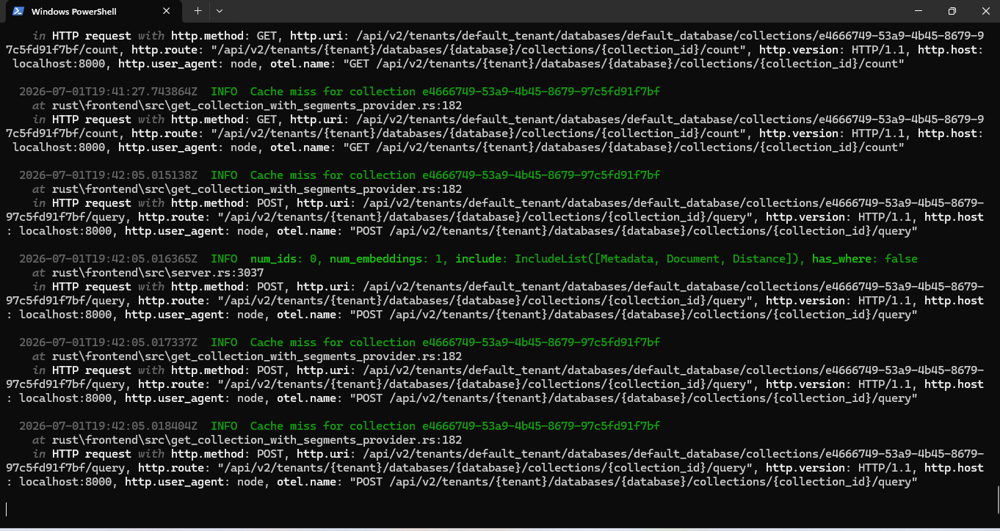
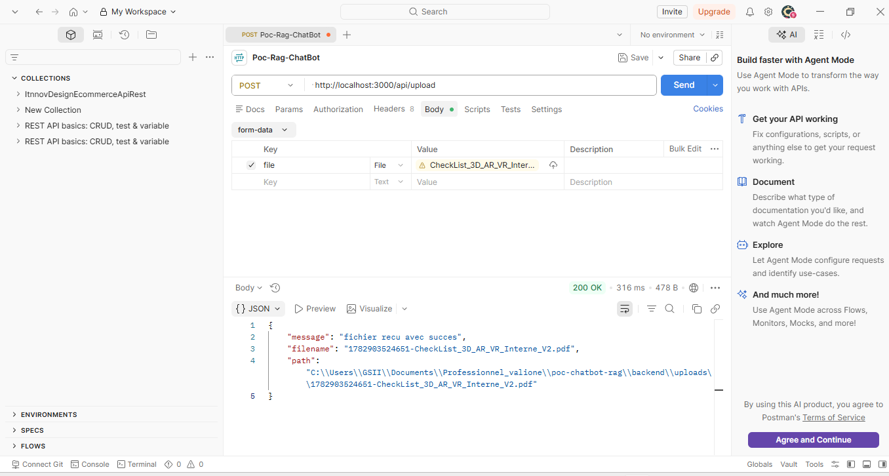
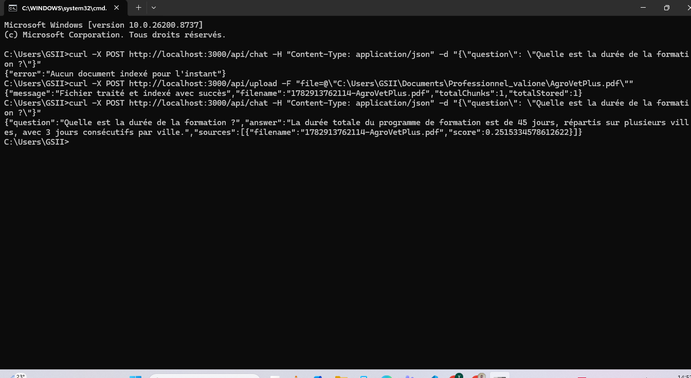
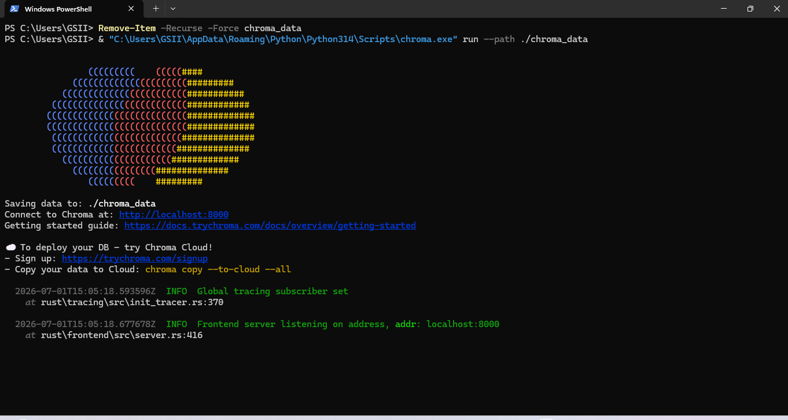
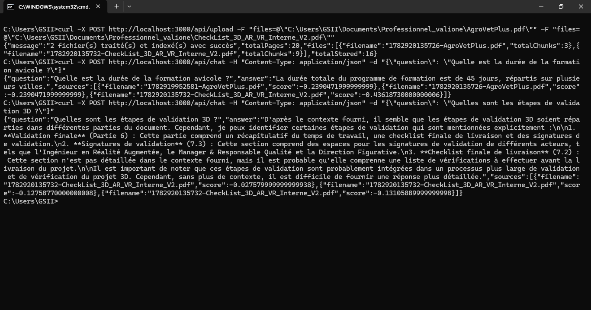
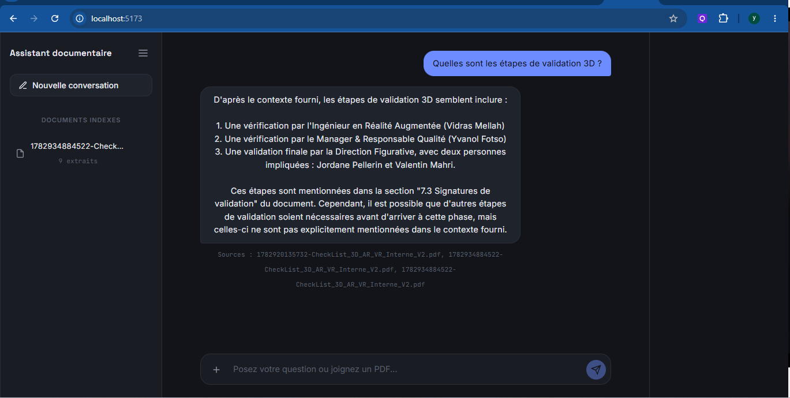
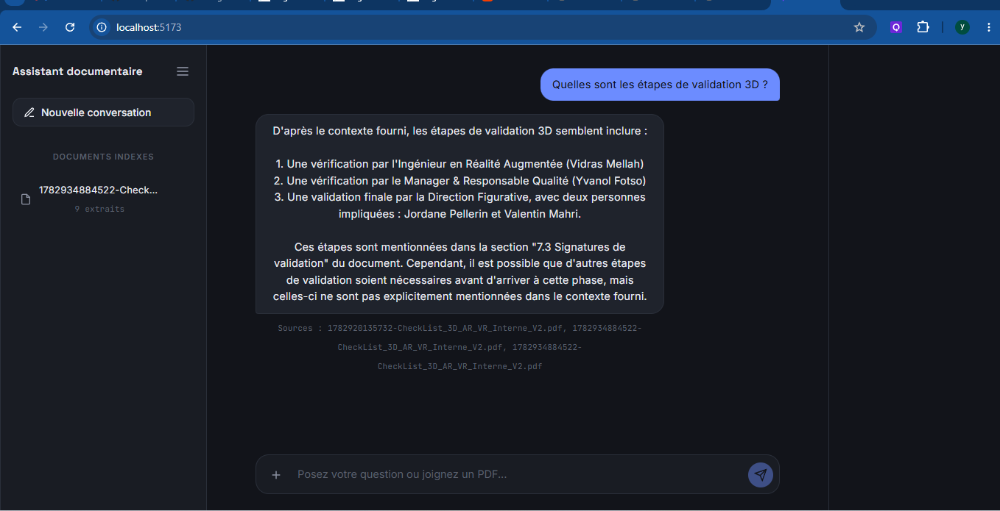
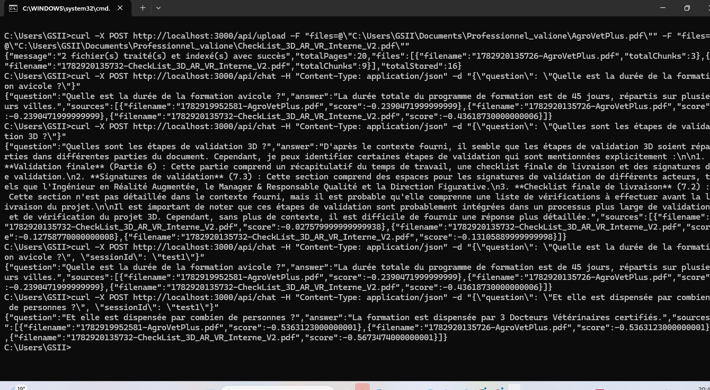

# POC Chatbot RAG

Proof of Concept du chatbot RAG permettant d'uploader des documents PDF (1 à 5 fichiers, 500 pages cumulées max) et de poser des questions dessus en langage naturel.

##  Stack technique

- **Backend** : Node.js / TypeScript, Express
- **Frontend** : React (Vite) / TypeScript
- **Embeddings** : `@xenova/transformers` (modèle `Xenova/all-MiniLM-L6-v2`, local, free)
- **Vector Database** : Chroma (persistance sur disque)
- **LLM** : Groq (modèle `llama-3.3-70b-versatile`, car gratuit)

## Fonctionnalités

- Upload de plusieurs PDF (1 à 5, max 500 pages cumulées)
- Extraction et nettoyage du texte
- Découpage en chunks avec chevauchement (overlap)
- Génération d'embeddings locaux
- Stockage vectoriel persistant via Chroma
- Recherche par similarité (retrieval)
- Génération de réponse contextualisée via LLM (Groq)
- Historique de conversation par session

> **Historique de conversation**
>
> Dans ce poc, l'historique des conversations est conservé **uniquement en mémoire** côté backend, à l'aide d'une `Map` associant chaque `sessionId` à la liste des messages échangés.
>
> aucun mecanisme de persistance (base de données, Redis) n'est utilisé. Par conséquent, toutes les conversations sont supprimées automatiquement lorsque le serveur est arrêté ou redémarré.


## Installation

### 1. Cloner le projet

```bash
git clone <url-du-repo>
cd poc-chatbot-rag
```

### 2. Installer et lancer Chroma (base vectorielle)

```bash
pip install chromadb
chroma run --path ./chroma_data
```

Laisse ce terminal ouvert. Chroma tourne sur `http://localhost:8000`.

### 3. Configurer et lancer le backend

Dans un nouveau terminal :

```bash
cd backend
npm install
```

Crée un fichier `.env` à la racine de `backend/` avec ta clé Groq :

```
GROQ_API_KEY=ta_cle_groq_ici
```

Lance le serveur :

```bash
npm run dev
```

Le backend tourne sur `http://localhost:3000`.

### 4. Lancer le frontend

Dans un nouveau terminal :

```bash
cd frontend
npm install
npm run dev
```

Le frontend tourne sur `http://localhost:5173`.

## Utilisation

1. Ouvre `http://localhost:5173` dans ton navigateur
2. Uploade un ou plusieurs PDF via le formulaire d'upload
3. Pose tes questions dans la zone de chat
4. Les réponses s'affichent avec les sources (documents) utilisées

## Architecture du projet

```
poc-chatbot-rag/
├── backend/
│   ├── src/
│   │   ├── routes/         # Routes API (upload, chat)
│   │   ├── services/       # Logique métier (extraction, chunking, embeddings, vectorStore, llm, conversationStore)
│   │   └── server.ts
│   └── uploads/             # PDF uploadés
├── frontend/
│   └── src/
│       ├── api/             # call du backend
│       └── components/      # FileUpload, ChatBox
```


## Test de l'API avec Postman ou cURL

**Postman** ou **cURL**.

### URL du backend

```
http://localhost:3000
```

---

### 1. Upload d'un ou plusieurs PDF

**Endpoint**

```
POST /api/upload
```

**URL complète**

```
http://localhost:3000/api/upload
```

dans le body add plusieur file.

####  avec cURL

```bash
curl -X POST http://localhost:3000/api/upload \
  -F "file=@/chemin-vers-document.pdf"
```

---

### 2. poser une question au chatbot

**Endpoint**

```
POST /api/chat
```

**URL complète**

```
http://localhost:3000/api/chat
```

#### Exemple avec cURL

```bash
curl -X POST http://localhost:3000/api/chat \
  -H "Content-Type: application/json" \
  -d "{\"question\":\"Quelle est la durée de la formation ?\"}"
```

---

###  avec Postman

Pour tester avec **Postman** :

- **Upload**
  - Méthode : `POST`
  - URL : `http://localhost:3000/api/upload`
  - Body → `form-data`
  - Clé : `file` (type **File**)
  - Sélectionner un ou plusieurs fichiers PDF

- **Chat**
  - Méthode : `POST`
  - URL : `http://localhost:3000/api/chat`
  - Header :
    ```
    Content-Type: application/json
    ```
  - Body → `raw` → `JSON`

```json
{
  "question": "Quelle est la durée de la formation ?"
}
```


## screenhots
















